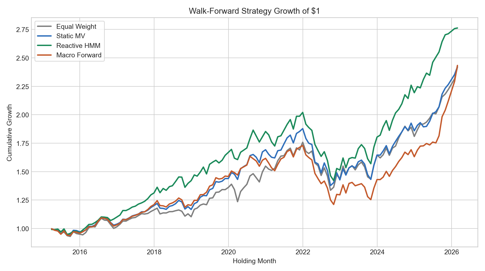
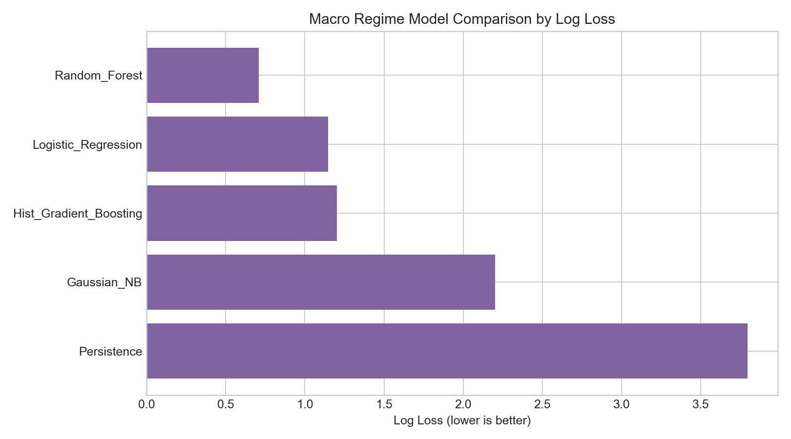
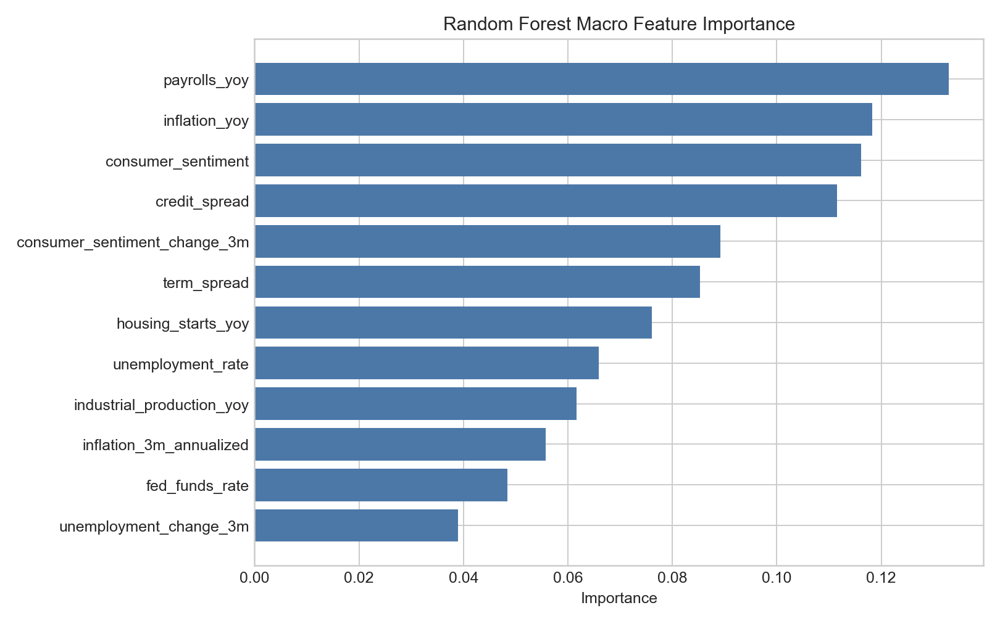
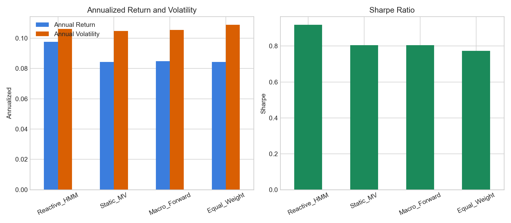
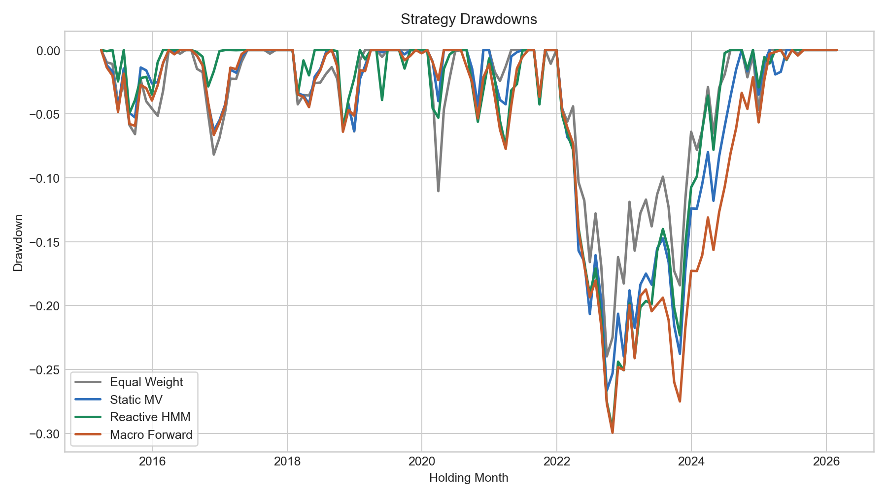
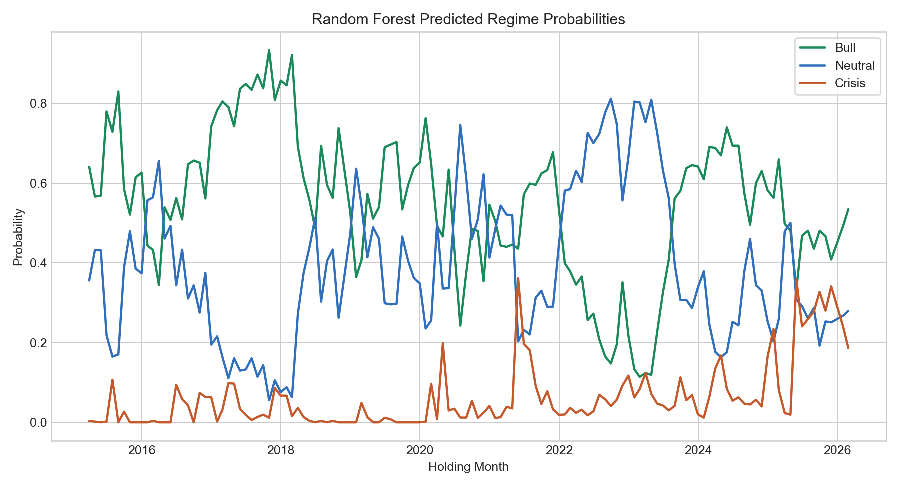
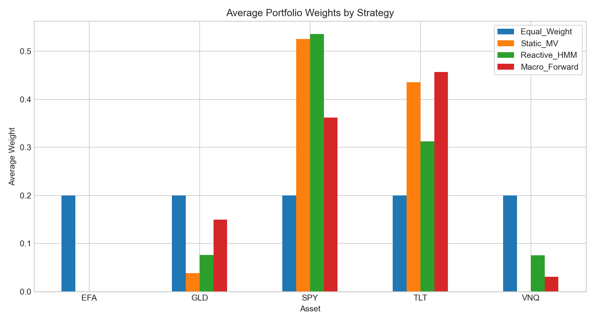
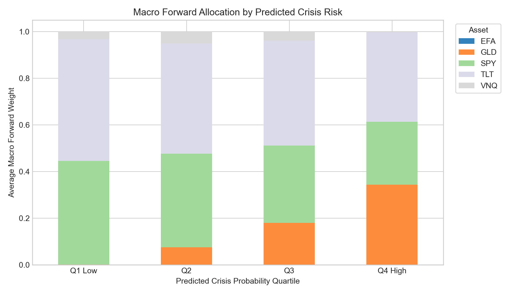

# Final Results Report

## Executive Summary

This project tested whether stochastic regime modeling and macroeconomic forecasting can improve portfolio allocation across a five-asset ETF universe: SPY, EFA, GLD, TLT, and VNQ.

The project developed three layers of portfolio logic:

1. A traditional static mean-variance portfolio.
2. A reactive Hidden Markov Model regime-switching portfolio.
3. A forward-looking macro-regime portfolio using FRED data to predict next-month HMM regimes.

The final result is nuanced. The macro model produces economically sensible probabilities and the forward-looking portfolio reacts in the intended way: when predicted Crisis risk rises, the strategy shifts toward GLD and TLT and away from SPY. However, this macro-forward allocation does not outperform the reactive HMM strategy in the final walk-forward backtest.

The strongest final strategy is `Reactive_HMM`, with a Sharpe ratio of 0.919. The `Macro_Forward` strategy is competitive with `Static_MV` and slightly better than `Equal_Weight`, but it does not deliver a clear performance edge over the simpler reactive regime approach.



## Notebook Roadmap

| Notebook | Role in the project |
|---|---|
| [01_market_data.ipynb](../notebooks/01_market_data.ipynb) | Loads market data, constructs asset price and return data, and establishes the ETF universe. |
| [02_covariance_estimation.ipynb](../notebooks/02_covariance_estimation.ipynb) | Estimates daily and annual covariance matrices for the asset universe. |
| [03_portfolio_optimization.ipynb](../notebooks/03_portfolio_optimization.ipynb) | Builds baseline equal-weight, minimum-variance, and maximum-Sharpe portfolios. |
| [04_market_regime_detection.ipynb](../notebooks/04_market_regime_detection.ipynb) | Fits a Hidden Markov Model to market features and labels regimes as Bull, Neutral, and Crisis. |
| [05_regime_specific_portfolio.ipynb](../notebooks/05_regime_specific_portfolio.ipynb) | Estimates regime-specific mean returns, covariances, and optimized portfolios. |
| [06_basic_regime_switching_backtest.ipynb](../notebooks/06_basic_regime_switching_backtest.ipynb) | Tests a reactive HMM regime-switching portfolio. |
| [07_macro_regime_prediction.ipynb](../notebooks/07_macro_regime_prediction.ipynb) | Uses lagged FRED macro features to predict next-month HMM regimes. |
| [08_macro_forward_regime_backtest.ipynb](../notebooks/08_macro_forward_regime_backtest.ipynb) | Uses predicted regime probabilities to construct and backtest the macro-forward portfolio. |

## Data and Asset Universe

The asset universe was chosen to span major portfolio risk exposures:

| Ticker | Asset class | Portfolio role |
|---|---|---|
| SPY | US equities | Growth and equity beta |
| EFA | Developed international equities | International equity diversification |
| GLD | Gold | Crisis hedge and inflation-sensitive asset |
| TLT | Long-term US Treasuries | Duration and defensive ballast |
| VNQ | US real estate | Real asset and income-sensitive exposure |

The macro model in [Notebook 7](../notebooks/07_macro_regime_prediction.ipynb) used FRED indicators covering:

- unemployment and labor-market momentum
- inflation
- Fed funds rate
- industrial production
- payroll growth
- consumer sentiment
- term spread
- credit spread
- housing starts

All macro features were lagged by one month to reduce look-ahead risk.

## Baseline Portfolio Optimization

[Notebook 3](../notebooks/03_portfolio_optimization.ipynb) established the basic mean-variance benchmark. Using historical expected returns and covariance estimates, the maximum-Sharpe portfolio improved on equal weight in the static setting.

| Portfolio | Return | Volatility | Sharpe Ratio |
|---|---:|---:|---:|
| Equal Weight | 7.93% | 11.08% | 0.390 |
| Minimum Variance | 7.32% | 8.95% | 0.416 |
| Maximum Sharpe | 10.16% | 10.80% | 0.607 |

This result motivates using optimization, but it does not yet account for regime shifts. The later notebooks ask whether different market states require different portfolio assumptions.

## Market Regime Detection

[Notebook 4](../notebooks/04_market_regime_detection.ipynb) used a Hidden Markov Model to identify latent market regimes from market-based features. The regimes are interpreted as:

- `Bull`: favorable market state with stronger equity behavior
- `Neutral`: middling or defensive state
- `Crisis`: stressed state with substantially different asset behavior

The HMM transition matrix shows strong regime persistence. This is important because a simple persistence rule is hard to beat on hard-label accuracy, but it may still be poor for probability-sensitive portfolio allocation.

## Regime-Specific Portfolios

[Notebook 5](../notebooks/05_regime_specific_portfolio.ipynb) estimated regime-specific expected returns and covariance matrices. The point of this step was to let the optimizer see different market environments as different portfolio problems.

The regime-specific max-Sharpe estimates showed that optimal allocations can change substantially across regimes. That result motivated the reactive backtest in Notebook 6 and the macro-forward extension in Notebook 8.

## Reactive HMM Backtest

[Notebook 6](../notebooks/06_basic_regime_switching_backtest.ipynb) tested a reactive regime-switching strategy. At each monthly rebalance, it used only information available up to that date, inferred the current HMM regime, estimated regime-specific moments from historical data, and optimized a long-only max-Sharpe portfolio.

This strategy is reactive because it changes allocation after a regime has already been observed in market data. Even so, it became the strongest final benchmark. In the final comparison, `Reactive_HMM` produced the best annual return and Sharpe ratio.

## Macro Regime Prediction

[Notebook 7](../notebooks/07_macro_regime_prediction.ipynb) changed the problem from regime detection to regime forecasting. The supervised learning target was the next month's HMM regime, and the predictors were lagged macroeconomic features from FRED.

The models were evaluated with an expanding-window walk-forward design. Log loss was used as the primary model-selection metric because Notebook 8 needs probability forecasts, not only hard class labels.



| Model | Accuracy | Log Loss | Brier Score |
|---|---:|---:|---:|
| Random_Forest | 0.718 | 0.709 | 0.432 |
| Logistic_Regression | 0.595 | 1.146 | 0.562 |
| Hist_Gradient_Boosting | 0.679 | 1.201 | 0.515 |
| Gaussian_NB | 0.649 | 2.203 | 0.608 |
| Persistence | 0.794 | 3.797 | 0.412 |

The `Persistence` benchmark had the highest accuracy, but it assigns all probability mass to the current regime. That makes it overconfident and poor by log loss. The `Random_Forest` model was selected because it produced the best probability forecasts.

The most important features in the final Random Forest were payroll growth, inflation, consumer sentiment, credit spread, sentiment momentum, and term spread.



The Crisis class remains a major limitation. There are very few Crisis observations, so Crisis probabilities should be interpreted as a stress-risk signal rather than a precise crisis classifier.

## Forward-Looking Macro Backtest

[Notebook 8](../notebooks/08_macro_forward_regime_backtest.ipynb) used the `Random_Forest` probabilities from Notebook 7 to build a forward-looking allocation. Each month, the model supplied:

- `p_Bull`
- `p_Neutral`
- `p_Crisis`

These probabilities were used to blend regime-specific expected returns and covariance matrices:

```text
mixed expected return = sum(regime probability * regime expected return)
mixed covariance      = sum(regime probability * regime covariance)
```

The mixed moments were then passed to a long-only maximum-Sharpe optimizer.

The final comparison included four strategies:

| Strategy | Description |
|---|---|
| Equal_Weight | Fixed 20% allocation to each asset |
| Static_MV | Expanding-window mean-variance optimization without regimes |
| Reactive_HMM | Uses the currently observed HMM regime |
| Macro_Forward | Uses predicted next-month regime probabilities |

## Final Performance

| Strategy | Annual Return | Annual Volatility | Sharpe Ratio | Max Drawdown |
|---|---:|---:|---:|---:|
| Reactive_HMM | 9.75% | 10.61% | 0.919 | -29.66% |
| Static_MV | 8.44% | 10.47% | 0.806 | -26.66% |
| Macro_Forward | 8.49% | 10.54% | 0.805 | -29.96% |
| Equal_Weight | 8.42% | 10.89% | 0.773 | -23.98% |



The ranking is clear:

1. `Reactive_HMM` is the best performer by Sharpe ratio and annual return.
2. `Macro_Forward` is competitive with `Static_MV`.
3. `Macro_Forward` slightly improves on `Equal_Weight`.
4. `Macro_Forward` has the largest maximum drawdown, so the defensive signal did not consistently reduce downside risk.

The cumulative performance chart shows that `Reactive_HMM` compounds best over the full test period.


The drawdown chart shows that the macro-forward strategy did not avoid the major 2022 drawdown.



## Diagnostics

The diagnostics in Notebook 8 explain why the macro strategy is plausible but not dominant.

Average predicted probabilities were:

| Regime | Average probability |
|---|---:|
| Bull | 54.9% |
| Neutral | 38.9% |
| Crisis | 6.1% |



Average strategy weights show the main behavioral difference:

| Asset | Equal_Weight | Static_MV | Reactive_HMM | Macro_Forward |
|---|---:|---:|---:|---:|
| EFA | 20.0% | 0.0% | 0.0% | 0.0% |
| GLD | 20.0% | 3.9% | 7.6% | 15.0% |
| SPY | 20.0% | 52.6% | 53.6% | 36.2% |
| TLT | 20.0% | 43.6% | 31.2% | 45.7% |
| VNQ | 20.0% | 0.0% | 7.5% | 3.1% |



`Macro_Forward` is clearly more defensive than `Reactive_HMM`: it holds less SPY and more GLD/TLT on average.

The Crisis-probability diagnostic confirms that the macro signal is being used as intended:



When predicted Crisis risk is high, `Macro_Forward` shifts materially into GLD and TLT. The problem is not that the signal is ignored. The problem is that the signal is not timed well enough to outperform the reactive HMM benchmark over the full sample.

Turnover also matters:

| Strategy | Average monthly turnover |
|---|---:|
| Equal_Weight | 0.000 |
| Static_MV | 0.018 |
| Reactive_HMM | 0.339 |
| Macro_Forward | 0.174 |

`Macro_Forward` is smoother than `Reactive_HMM`, but it still trades more than `Static_MV`. If transaction costs were added, the gap between `Macro_Forward` and `Static_MV` could become less favorable.

## Interpretation

The macro model adds a forward-looking layer to the regime framework, and the resulting allocation is economically coherent. The strategy becomes more defensive when macro conditions imply higher Crisis probability. This is exactly the behavior the model was designed to produce.

However, the final backtest does not show that this forward-looking macro layer improves performance relative to the reactive HMM strategy. The main reasons are:

- The HMM regimes are highly persistent, making the current observed regime very informative.
- Crisis observations are rare, limiting the macro model's ability to learn crisis transitions.
- The macro strategy sometimes becomes defensive during months that are ultimately realized as Bull regimes.
- Max-Sharpe optimization is sensitive to expected-return estimates, especially when regime samples are small.

The right conclusion is not that macro data is useless. Rather, the current implementation is better interpreted as a risk-signal framework than as a complete superior allocation rule.

## Limitations

The main limitations are:

- FRED features are lagged, but not built from real-time ALFRED vintages.
- There are very few Crisis observations.
- Random Forest probabilities are not separately calibrated.
- No transaction costs or taxes are included.
- Optimization uses estimated means, which are noisy.
- The same HMM regime labels are treated as ground truth even though they are model-generated labels.

## Recommended Next Steps

The best next research steps are:

1. **Probability calibration**  
   Calibrate the Random Forest probabilities before using them in allocation.

2. **Blend macro forecasts with persistence**  
   Combine macro probabilities with current-regime persistence to avoid overreacting to noisy macro signals.

3. **Use macro probabilities for risk scaling**  
   Instead of blending both means and covariances, use macro probabilities mainly to scale risk exposure.

4. **Add transaction costs**  
   Compare strategies net of turnover costs.

5. **Use ALFRED real-time data vintages**  
   Replace final revised macro data with true point-in-time macro releases.

6. **Stress-test objectives**  
   Compare max-Sharpe optimization with minimum variance, risk parity, or drawdown-aware objectives.

## Final Conclusion

This project successfully builds a complete regime-aware portfolio pipeline:

```text
market data -> HMM regimes -> regime-specific portfolios
macro data -> regime probabilities -> forward-looking allocation
```

The final empirical finding is balanced:

```text
Macro regime forecasts create sensible defensive portfolio shifts,
but the reactive HMM strategy remains the strongest performer in this sample.
```

That is a useful result. It shows that the macro layer has economic content, but also that forward-looking signals need careful calibration and portfolio integration before they can outperform a simpler, persistent market-regime signal.
